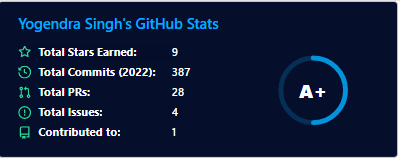

### Hi there, I'm Yogendra Singh 👋  

---

## I'm a Software Engineer and Life Long Learner!
- 🌱 I’m currently Learning MERN Stack at Masai School.
- 🌏 Looking to solve real-world problems.
- 💻 I'm passionate about making creative websites.
- ⚡ Fact: I love to be fit first.
- 💬 Ask me about Javascript, HTML, CSS, React, Redux, Nodejs, Git, Chakra Ui, Material Ui, Bootstrap, Node Js, Npm
- 🙏 Do 🌟 my repository if you find my projects interesting, at least your star could make someone's day. 
<em><b>I love connecting with different people</b> so if you want to say <b>hi, I'll be happy to meet you more!</b> :blush:</em>

---

<h4 align="center">Visitor's count :eyes:</h4>

---

### 👨‍💻 Languages and Tools:
<code></code>
<code></code>
<code></code>
<code></code>
<code></code>
<code></code>
<code></code>
<code></code>
<code></code>
<code></code>
<code></code>
<code></code>
<code></code>
<code></code>
<code></code>
<code></code>
<code></code>
<code></code>
 

---

### Desktop Environment:
<code></code>
<code></code>
<code></code>

---

  
  
  

---

  
